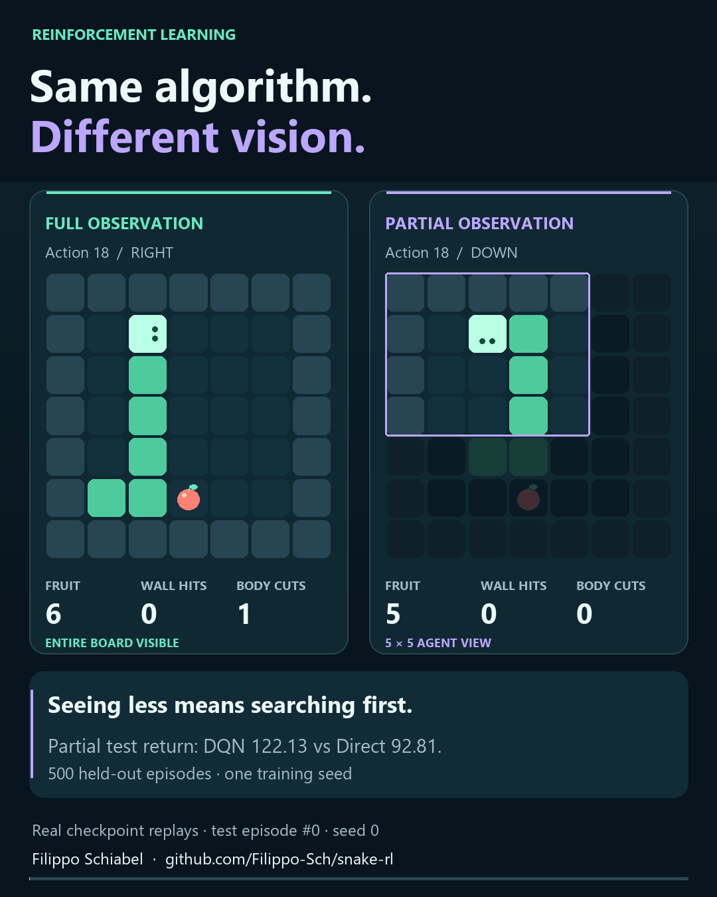

# Learning to Play Snake

DQN agents, heuristic baselines, and reproducible experiments with full and
partial observation.

**Filippo Schiabel** · Reinforcement Learning course project, University of Padua,
academic year 2025/2026.

The project studies two tasks. In the course-provided Snake environment, agents
collect fruit over a fixed horizon while limiting wall hits; collisions are
nonfatal and body contacts cut the snake. A separate Classic Snake environment
makes collisions fatal and rewards completing the board. Each task compares
learned policies with non-learning heuristics under full and partial observation.

[Read the report](report/snake_rl_report.pdf) for the methodology, learning curves,
controlled continuations, and limitations. The repository contains the training
code, six selected checkpoints, environments, and compact evidence needed to
reconstruct the results.

## Watch the agents

[](https://filippo-sch.github.io/snake-rl/visualizations/)

[Open the interactive replay](https://filippo-sch.github.io/snake-rl/visualizations/)
or [download the 49-second portrait video](https://github.com/Filippo-Sch/snake-rl/releases/tag/v1.1.0).
Compare all six configurations, pause, scrub through decisions, change playback
speed, and inspect the exact observation seen by each agent. Every panel shows
held-out test episode 0; native replay preserves the original 500-board RNG
allocation. The illustrated episodes were not selected by outcome.

This is a visual supplement prepared after completion of the course project.
The final submission remains available in release v1.0.0. To regenerate the page,
run `python -m visualizations`; add `--video` to export the MP4 using FFmpeg on
PATH, or `--ffmpeg PATH` to specify its executable. No extra Python packages are
needed beyond the project requirements. The optional video is written to
`results/visualizations/snake_rl_linkedin.mp4`.

## Results

Mean test return in the original task, using 500 episodes per row:

| Board | Observation | Direct heuristic | DQN |
| --- | --- | ---: | ---: |
| 7 x 7 | Full | 132.41 | 133.27 |
| 7 x 7 | Partial | 92.81 | 122.13 |
| 11 x 11 | Full | 75.63 | 71.95 |
| 11 x 11 | Partial | 16.92 | 32.88 |

In Classic Snake, full-observation DQN completes **283 of 500**
test games; partial-observation DQN completes **4 of 500**
and often settles into exact physical-state cycles. Partial observation improves
hidden-fruit discovery in the original task, but remains difficult when collisions
are fatal. The reported comparisons use frozen policies selected on validation;
all root seeds are 0, so these results do not establish robustness across training
seeds.

## Run and verify

Run these commands from the repository root. Use Python 3.11 on CPU.
On Windows, a long virtual-environment path can cause pip's `WinError 206`;
use a shorter path if needed.

```console
python -m pip install -r requirements.txt
python evaluate.py
```

**Open `results/index.html` after the command finishes.** This single offline page
contains the four report tables, confidence intervals, both learning figures,
checkpoint selection and supporting diagnostics. It links to the report PDF and
CSV data. No browser server, notebook or additional command is needed.
The native comparison includes all three heuristic returns; the selection section
shows every A/B/C schedule's final-eight validation mean.

The default verifies the archived evidence and all six checkpoints, compares
120 printed report values, reconstructs the figures, and independently replays
the **final held-out tests in both environments: 500 episodes per policy and
configuration**, totalling 8,000 native and 3,000 Classic episodes. Every episode
record is compared with the archived results. Allow tens of minutes on CPU;
the terminal reports progress by environment and board size, then gives the
results page path. Learning histories and supporting diagnostics are reconstructed
from the supplied evidence; evaluation does not retrain or reselect checkpoints.
Errors return a nonzero exit status.

## Optional modes

Use `--quick` for a short functional check: 256 native validation episodes and
60 Classic held-out test episodes, usually about one to two minutes on CPU.
The terminal prints the sample's performance for each policy. This sample is
separate from the final test bank and is not the report's final evaluation.
Use `--full` to add 4,000 native diagnostic trajectories to the default final
tests, comparing them with the archive as well.
`--archive-only` reconstructs and verifies the report in seconds without play.
All modes produce `results/index.html`, which states the checks actually run.
The mode flags are mutually exclusive; `--output DIRECTORY` selects a separate
results directory.

Complete retraining is optional:

```console
python -m experiments.campaign
```

This runs all shared native A/B/C branches and Classic continuations, selects
using validation, evaluates the resulting policies, extracts diagnostics and
reconstructs the results in `results/from_scratch`. It comprises 35.840 million
unique transitions and needs hours and several GB for replay/optimizer snapshots.
Use `--plan` to inspect the stages or `--resume` to continue committed snapshots.
The full campaign was not rerun during packaging; training updates, snapshot
resume and campaign dispatch were checked separately.

## Package layout

| Path | Contents |
| --- | --- |
| `evaluate.py` | Main verification and evaluation command |
| `train.py`, `experiments/` | Native training and complete experiment campaign |
| `snake/` | Environments, heuristic policies and DQN implementations |
| `weights/` | Six selected inference checkpoints and their hashes |
| `evidence/` | Episode records, validation histories and compact diagnostics |
| `analysis/` | Table aggregation, plotting and verification |
| `report/` | Submitted PDF; LaTeX template, source and figures in `source/` |
| `results/` | Created by evaluation; one results page plus CSV/JSON details |

## Protocol and scope

All root seeds are 0. Training, validation and test use separate derived streams.
The report's native test uses 500 boards, 1,000 actions and MT19937 test stream 3;
Classic uses 500 independent games per policy, capped at 5,000 actions without
the training fruit-free cutoff. Native batch size affects RNG allocation: the
quick 16-board sample is not a prefix of the 500-board report bank. Archived
reconstruction verifies saved evidence; the default independently recreates all
final test episodes. `--full` additionally recreates the native diagnostics.

Native intervals pair DQN and Direct by episode ID. Classic completion intervals
use Wilson's method. They quantify episode uncertainty for frozen policies,
not robustness across training seeds. Selection uses validation only; schedules
share training prefixes. The earlier 11-partial policy's 247 search failures are
included in the data; its weights are regenerated by complete retraining.
The 100,000 final replay slots retain reward, terminal/truncation flags and body
length, allowing direct recounting without large state tensors.

Verified runtime: Python 3.11.9, NumPy 1.26.4, PyTorch 2.13.0+cpu, Matplotlib 3.8.3.
Other platforms can introduce numerical differences. Classic continuations
require their recorded parent selections and matching source/runtime snapshots;
the runner fails explicitly if a new run changes those conditions. The six
inference checkpoints alone do not contain the replay/optimizer state for resume.

Checkpoint metadata use relative paths. The weight manifest records the original
checkpoint hashes and tensor hashes for the two Classic inference exports;
their learned tensors are unchanged. Historical source hashes describe the
training files, whose entry-point names can differ from this package's layout.

## Attribution

The native environment files `snake/environments_fully_observable.py` and
`snake/environments_partially_observable.py` were supplied for the course. The
Classic environment, policies, experiment procedures, and report form the project
work. The report uses the supplied ICML 2021 LaTeX template; bundled style files
retain their original authorship and copyright or license notices. No blanket
license is declared for these third-party materials.

This repository is based on the final submission. Its original training and
evaluation source, checkpoints, scientific evidence, and report are unchanged.
The visualizations module is a later presentation supplement; the README and
Git configuration are adapted for publication. The original submission ZIP and PDF are available
in the [v1.0.0 release](https://github.com/Filippo-Sch/snake-rl/releases/tag/v1.0.0).
